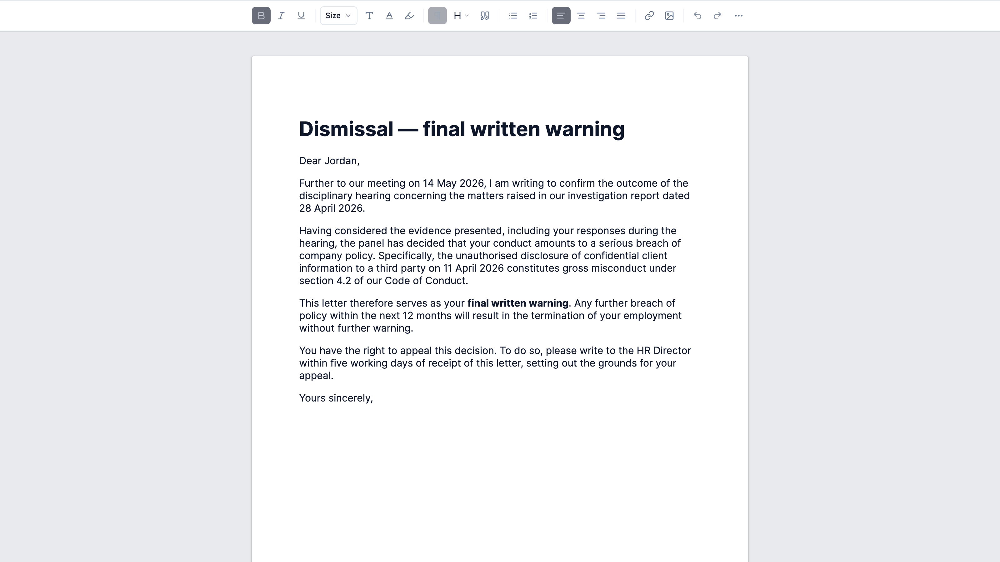

# Pagedly

**A Word-style paged rich-text editor for React.**
Multi-page layout that reflows like Microsoft Word — page boundaries appear as you type, content flows onto the next page, and the printed output matches the editing view.



---

## What it does

Most rich-text editors give you a continuous scroll. Pagedly gives you **real pages**:

- Word-level reflow at page boundaries — type past the bottom of a page and the words slide onto the next sheet, mid-paragraph, mid-sentence.
- The edit surface looks like the print surface. What you see on screen is what comes out of the printer.
- Print to A4 (or save to PDF via the browser print dialog) with letterhead, signature, and attachment chrome injected at print time.
- In-document find / replace with all matches highlighted at once.
- Toolbar with bold / italic / underline / lists / alignment / quote, font family (system + 14 Google fonts loaded on demand), font size, text + highlight colors, links, images (auto-downscaled), tables, manual page breaks.
- Cross-browser: Chromium and WebKit verified, Playwright e2e suite ships with the package.

---

## See it

Live demo: **[pagedly.dev](https://pagedly.dev)**

---

## Use cases

- Letter generators (HR, legal, finance) — the original problem we built this for.
- Contract editors with named sections and per-section persistence.
- Report builders where the print layout has to match the edit view exactly.
- Any product where "this is a document, not a feed" matters.

---

## How it works

Pagedly drops into any React app — Vite, Next.js (App Router or Pages Router), Remix, CRA, Astro React islands, TanStack Start. The editor renders client-side; in Next.js App Router you import it inside a `"use client"` component.

```tsx
"use client";
import { LetterEditor, type LetterDraft } from "pagedly";
import "pagedly/styles.css";

export function MyLetter() {
  const [draft, setDraft] = useState<LetterDraft>(/* ... */);
  return <LetterEditor draft={draft} onDraftChange={setDraft} />;
}
```

Full API documentation ships with the package.

---

## Pricing & purchase

Buy Pagedly here: **[pagedly.dev](https://pagedly.dev)** (powered by [polar.sh](https://polar.sh))

After purchase you receive a `pagedly-X.Y.Z.tgz` package by email and via your customer dashboard. Drop it into your project root and `npm install ./pagedly-X.Y.Z.tgz`.

---

## License

Pagedly is sold under a **commercial proprietary license** — perpetual right to use and modify the source within your own applications, no standalone redistribution, no public hosting of the source, no use to build a competing paged-editor product.

Full terms are included with the package. For licensing questions: `licensing@pagedly.dev`.

---

## Support

- **Questions before buying** → `hello@pagedly.dev`
- **Licensing** → `licensing@pagedly.dev`
- **Customer support after purchase** → handled through your customer dashboard.

---

*This repository contains only the marketing README. The source code is delivered to paying customers through their dashboard — it is not hosted publicly.*
